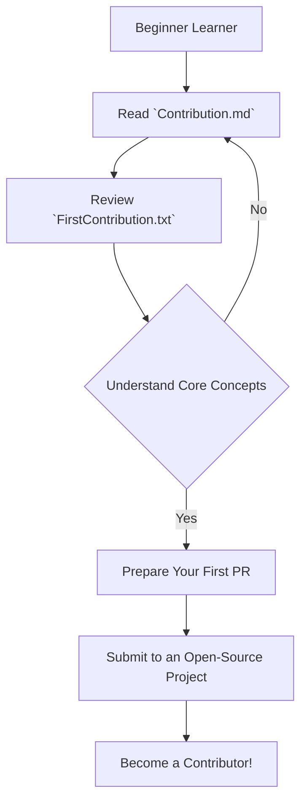

# 🚀 pavan: Your Gateway to Open-Source Contributions!

## Short Description
The `pavan` repository is your dedicated launchpad into the exciting world of open-source! Designed with beginners in mind, this project provides crystal-clear guidance and practical examples to demystify the contribution process, making your first pull request a breeze. It's an indispensable resource for anyone eager to join the global developer community and make a meaningful impact.

## ✨ Key Features
*   **Comprehensive Contribution Guide (`Contribution.md`):** A step-by-step walkthrough detailing best practices, workflow, and expectations for contributing to open-source projects.
*   **Practical First Contribution Example (`FirstContribution.txt`):** A hands-on, tangible example designed to show you exactly what a simple contribution looks like, from idea to commit.
*   **Clear, Actionable Steps:** We break down complex processes into easy-to-follow instructions, ensuring a smooth onboarding experience.
*   **Foundational Open-Source Etiquette:** Learn not just *how* to contribute, but *how to contribute effectively and respectfully* within the open-source ecosystem.

## Who is this for?
*   **Aspiring Open-Source Contributors:** New to GitHub or Git and unsure where to start? This guide is for you.
*   **Students and Junior Developers:** Looking to enhance your skills, build your portfolio, and collaborate on real-world projects.
*   **Project Maintainers:** Seeking a simple, effective template to onboard new contributors to your own projects.

## Technology Stack & Architecture
This repository isn't a traditional "software" project with a complex tech stack. Instead, it leverages the power of plain text and Markdown for maximum accessibility and readability. It's an educational resource, architected around structured documentation designed for human consumption. The "stack" here is effective communication and clear instructional design, making open-source contribution approachable for everyone.

## 📊 Architecture & Database Schema
While not a system architecture in the traditional sense, this diagram illustrates the logical flow for a new contributor engaging with this repository's guidance.



## ⚡ Quick Start Guide
Getting started with `pavan` is incredibly simple. Follow these steps to kickstart your open-source journey:

1.  **Clone the Repository:**
    ```bash
    git clone https://github.com/pavanigangisetti/pavan.git
    cd pavan
    ```
2.  **Explore the Guide:** Open and thoroughly read `Contribution.md`. This file contains all the essential information you need.
3.  **Review the Example:** Examine `FirstContribution.txt` to see a practical demonstration of a basic contribution.
4.  **Practice:** Use the knowledge gained to prepare your own first contribution, whether to this repository (if applicable) or another open-source project!

Start contributing today and become part of something bigger!